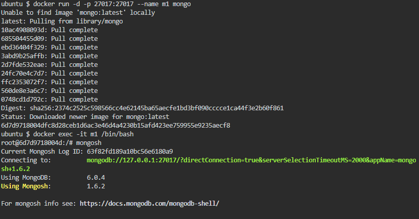

# Resultado LAB-01

## Parte 1

- Descargar imagen de Nginx v1.22.1

## Parte 2

- Iniciar container de MySQL

- Revisar logs del container de MySQL

- Acceder al container de MySQL

- Iniciar container de PHPMyAdmin

- Acceder a container de PHPMyAdmin mediante el puerto 82

- Detener y borrar contenedores de MySQL y PHPMyAdmin

# Resultado LAB-02

- Iniciar y acceder a container MongoDB 

- Instalar librería de mongo

- Ejecutar los scripts populate.py y find.py

- Revisar los registros por medio del CLI de mongo

- Detener y borrar contenedor MongoDB

# Resultado LAB-03

- Crear servidor con imagen de Nginx previamente descargada

- Copiar contenido de la carpeta web en la ruta que sirve este servidor web y ejecutar dentro del container el comando ls para comprobar que los archivos se copiaron correctamente

- Acceder al servidor web mediante el puerto 9999

